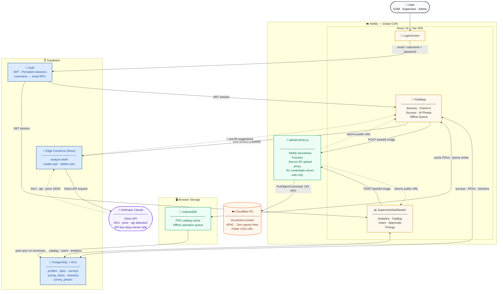

# eTradeExecution (ETX)

**AB InBev CAM International — Trade Marketing Field Survey Platform**

A mobile-first Progressive Web App that enables field sales representatives (GVMs) across Central America and Venezuela to execute trade marketing audits in real time, with AI-powered photo analysis, full offline support, and a live BI analytics dashboard for supervisors and administrators.

---

## Table of Contents

1. [Overview](#overview)
2. [Tech Stack](#tech-stack)
3. [Architecture](#architecture)
4. [User Roles](#user-roles)
5. [Features](#features)
6. [Survey Types](#survey-types)
7. [AI Integration](#ai-integration)
8. [Image Storage — Cloudflare R2](#image-storage--cloudflare-r2)
9. [Offline Support](#offline-support)
10. [Analytics Dashboard](#analytics-dashboard)
11. [Database Schema](#database-schema)
12. [Project Structure](#project-structure)
13. [Environment Variables](#environment-variables)
14. [Local Development](#local-development)
15. [Deployment](#deployment)
16. [Security](#security)
17. [Demo Credentials](#demo-credentials)

---

## Overview

ETX is a web-based SPA built for AB InBev's CAM (Central America & Caribbean) International trade marketing team. It replaces paper-based field surveys with a structured digital workflow covering **6 countries**: Venezuela, Panamá, Costa Rica, Guatemala, Honduras, and El Salvador.

The platform solves three problems:

1. **Field execution** — GVM field agents follow a structured daily itinerary, check in to stores via GPS, and complete standardized surveys covering prices, inventory, coolers, shelf displays, POP materials, and competitive intelligence.
2. **Supervision** — Country supervisors monitor real-time coverage, GVM compliance, and receive approval requests for new store additions.
3. **Administration** — Global admins manage all countries, users, the full PDV catalog, and export Excel reports for leadership.

**Live app**: [peaceful-paletas-40c447.netlify.app](https://peaceful-paletas-40c447.netlify.app)

---

## Tech Stack

| Layer | Technology | Version |
|---|---|---|
| Frontend framework | React | 18.3.1 |
| Build tool | Vite | 5.4.6 |
| Charts | Recharts | 3.8.1 |
| Icons | Lucide React | 0.439.0 |
| Routing (auth shell) | React Router DOM | 6.26.2 |
| Database + Auth | Supabase (PostgreSQL + RLS) | 2.45.4 |
| AI Vision | Anthropic Claude via Supabase Edge Function | — |
| Image Storage | Cloudflare R2 (S3-compatible) | — |
| R2 Upload Proxy | AWS SDK S3 Client in Netlify Function | 3.750.0 |
| Spreadsheet | SheetJS (xlsx) | 0.18.5 |
| Offline queue | IndexedDB (native browser API) | — |
| Hosting | Netlify (CDN + serverless functions) | — |

---

## Architecture



### Data Flow Summary

| Step | From | To | Description |
|---|---|---|---|
| 1 | User | LoginScreen → Supabase Auth | Authenticate with email or username; receive JWT |
| 2 | App.jsx | Supabase DB | Load user profile + PDV catalog filtered by role/country |
| 3 | FieldApp | Supabase DB | CRUD — surveys, check-ins, survey items, photos |
| 4 | FieldApp | IndexedDB | Cache PDV catalog and queue offline writes |
| 5 | IndexedDB | Supabase DB | Replay queued operations automatically on reconnect |
| 6 | FieldApp / Dashboard | Netlify Function → R2 | Upload photo as base64; function stores it in R2; returns public URL |
| 7 | FieldApp | Supabase Edge → Anthropic | Send shelf photos for AI analysis; receive SKU/qty/price suggestions |
| 8 | Supervisors / Admins | Supabase DB | Analytics queries, catalog management, user management, approval workflow |

---

## User Roles

The platform enforces a three-tier role hierarchy through Postgres Row Level Security policies. Every query is scoped to the caller's role and country before data is returned.

### GVM (Gestor de Ventas de Mercado)
Field sales representative. Mobile FieldApp only. Can:
- View and reorder their assigned PDV itinerary
- Check in to stores (GPS geofence validation + photo)
- Complete any of the 6 survey types
- Capture photos with optional AI pre-fill
- Browse and request assignment from the unassigned PDV pool
- Submit new store requests for supervisor approval
- Work fully offline — surveys queue locally and sync on reconnect

### Supervisor
Country-level trade marketing manager. SupervisorDashboard, scoped to their country. Can:
- View the analytics dashboard for their country
- Manage the PDV catalog (add, edit, delete, bulk import via XLSX)
- Assign PDVs to GVMs
- Manage GVM accounts in their country
- Approve or reject new PDV requests from GVMs
- View visit timing data and GVM compliance

### Admin
AB InBev CAM International administrator. Full access across all 6 countries. Everything a supervisor can do, plus:
- Cross-country analytics view
- Create/edit/delete supervisor accounts
- Bulk import PDV catalogs for any country
- View all data, all countries

---

## Features

### Field App (GVM)

**Itinerary Screen**
- Ordered list of assigned PDVs with real-time check-in status indicators (pending / processing / done)
- KPI summary at the top: Visitados / Planeados / Cobertura %
- Custom drag-to-reorder, persisted in `localStorage`
- Quick-access buttons: Pool (unassigned PDVs), New PDV request

**Check-in**
- Captures GPS coordinates via the Geolocation API
- Calculates Haversine distance to the PDV's stored coordinates
- Flags if outside geofence with distance shown in meters
- Requires a photo capture (live camera, with "EN VIVO" watermark and timestamp)
- Immediately navigates to the PDV detail page after capture; GPS validation continues in the background

**PDV Detail**
- Store info (address, category, channel, distributor, coordinates) behind a collapsible toggle
- Survey launcher cards for all 6 survey types
- Check-in status badge

**Surveys** (see [Survey Types](#survey-types))

**Pool Screen**
- Browse unassigned PDVs in the same country
- One-tap request to be assigned

**New PDV Request**
- Form: store name, category, channel, address, GPS coordinates, photo
- Submitted to supervisor approval queue

**Profile Screen**
- Display name, role, country, account info
- Logout

**Offline Banner**
- Sticky footer showing count of pending queued operations
- Manual "Sync now" button
- Auto-hides when queue is empty

---

### Supervisor / Admin Dashboard

Five tabs accessible from an underline-style tab bar:

#### Resumen (Overview)
Fully responsive analytics dashboard built with Recharts.

- **Analytics sub-tabs**: Overview · Precios · Góndola & Nevera · Competencia · Inventario
- **PDV filter pills** — filter all charts and KPIs by a specific store or view all
- **6 KPI cards** with colored bottom-border accents:
  - Market Share ABI (volume %)
  - Share of Shelf (average across PDVs)
  - PDVs Sobre Precio (count over suggested price)
  - Neveras Exclusiva (% exclusive coolers)
  - Disponibilidad (availability %)
  - Acciones Competencia (competitor action alerts)
- **Donut chart** — Market share by brand with center label and legend
- **Line chart** — 6-week ABI portfolio vs. competition share trend (gold vs. gray dashed)
- **Horizontal bar chart** — Share of shelf per PDV
- **Radar chart** — Execution scorecard across 6 axes (Share Góndola, Precio, Neveras, Material POP, Disponibilidad, Exclusividad)
- **GVM compliance table** — progress bars per field rep with % and PDV count

On mobile (< 640px) chart grids stack to single column; sub-tabs scroll horizontally.

#### Catálogo
- Searchable, paginated PDV table
- Assign / unassign PDVs to GVMs
- Delete PDVs
- XLSX / CSV bulk import with column mapping preview

#### Usuarios
- Create, edit, and delete user accounts
- Role and country filters
- Role-scoped: supervisors can only create GVMs in their country; admins can create any role

#### Solicitudes (Approvals)
- Review new PDV requests submitted by GVMs
- Approve (creates the PDV in Supabase) or Reject with one tap
- Bell badge on the tab shows pending count
- Also accessible from the top-bar notification button

#### Tiempos (Timings)
- Visit duration analytics per GVM and per PDV
- Average time per survey type

---

## Survey Types

All 6 surveys share the same base structure: a header saved to `surveys`, optional line items to `survey_items`, and optional photos uploaded to Cloudflare R2 with URLs in `survey_photos`.

| Key | Display Name | What is captured |
|---|---|---|
| `precios` | Precios | Shelf price per SKU vs. suggested retail price (PSV); AI photo analysis available |
| `inventario` | Inventario | Unit count per SKU; out-of-stock flags; AI photo counting available |
| `neveras` | Refrigerator | Cooler condition (Excelente/Buena/Regular/Mala), brand exclusivity, temperature, cleanliness, photo |
| `gondolas` | Góndolas | Planogram compliance, facing count, visibility, placement photos |
| `pop` | Material POP | POP material types present, condition, placement |
| `competencia` | Acciones de la Competencia | Competitor promotional activities, new SKUs spotted, pricing actions |

### Product Catalog

Each country has its own SKU list defined in `src/lib/constants.jsx` (`getProductsForCountry`). The catalog includes both ABI portfolio brands and local/competitor brands, with the `abi: true` flag distinguishing them. Each SKU has a suggested price (`psv`) in the country's currency.

Venezuela currently has the most complete catalog (41 SKUs covering Cervecería Polar, Regional, and AB InBev imported brands).

---

## AI Integration

Two survey types offer optional AI-powered photo analysis using **Anthropic Claude** (vision model) via a Supabase Edge Function proxy. The Anthropic API key is stored as a Supabase secret and is never sent to the browser.

### How it works

1. GVM captures one or more photos using the in-app camera
2. Each photo is converted to base64 in the browser
3. A `POST` is sent to `VITE_AI_PROXY_URL` (the Edge Function) with the base64 images
4. The Edge Function forwards to the Anthropic API with a structured prompt
5. Claude returns a JSON array of `{ sku, qty }` (inventory) or `{ sku, price }` (prices)
6. The app pre-fills the survey table with these values, marked with a ✨ badge
7. The GVM can adjust or ignore any AI suggestion before saving

### Inventory Analysis (`analyzeInventoryPhotos`)
- Identifies visible beer brands and counts units per SKU
- Multi-photo support — quantities summed across all photos to cover different shelf zones
- Out-of-stock is inferred when qty = 0 for a known SKU

### Price Analysis (`analyzePricePhotos`)
- Reads price tags and associates them with known brand names
- Returns prices in the country's local currency
- Unrecognized prices are ignored; GVM fills those manually

---

## Image Storage — Cloudflare R2

All survey photos and check-in photos are stored in the **`etx-photos`** Cloudflare R2 bucket. R2 is S3-compatible with zero egress fees.

| Detail | Value |
|---|---|
| Bucket | `etx-photos` |
| Region | APAC |
| Public base URL | `https://pub-b14d5c840d8849f6aa04eee261c58f22.r2.dev` |
| S3 endpoint | `https://<R2_ACCOUNT_ID>.r2.cloudflarestorage.com` |

### Upload flow

```
GVM takes photo (in-app camera)
  → FileReader converts File to base64 in the browser
  → POST /.netlify/functions/upload-photo
       body: { base64, contentType, filename }
  → Netlify serverless function (upload-photo.js):
       - Reads R2_ACCOUNT_ID, R2_ACCESS_KEY_ID, R2_SECRET_ACCESS_KEY from env vars
       - Creates S3Client pointed at R2 endpoint
       - Calls PutObjectCommand to store the image
       - Returns { url, path }
  → Frontend saves the URL to Supabase survey_photos table
  → Photos displayed in app and dashboard via the public R2 URL
```

**Why not upload directly from the browser?** The S3 secret key must never be exposed in client-side JavaScript. The Netlify function acts as a secure server-side proxy — credentials live only in Netlify's environment variable store.

### Object key structure

```
surveys/{pdv_id}/{kind}-{timestamp}.{ext}
```

Example: `surveys/3a8f1b2c/inventario-1750000000000.jpg`

### Cloudflare R2 free tier
- 10 GB storage
- 1 million Class A (write) operations/month
- 10 million Class B (read) operations/month
- Zero egress fees

---

## Offline Support

The app uses the browser's native **IndexedDB** API (`src/lib/offline.js`) with two object stores:

### `pdvs` store — Catalog cache
The full PDV catalog is written to IndexedDB after every successful data load. If the app is opened with no connectivity, the cached catalog is loaded and a warning toast is shown.

### `queue` store — Operation queue
When a survey submission or check-in fails because the device is offline, the operation is serialized and pushed to the queue. Each entry has a type (`survey` or `checkin`), the full payload, and a timestamp.

### Auto-sync flow
1. The browser fires the `online` event when connectivity is restored
2. `App.jsx` calls `syncQueue()` automatically
3. Each queued operation is replayed against Supabase in insertion order
4. Successfully synced items are deleted from the queue
5. A toast shows how many operations were synced
6. The `OfflineBanner` (sticky bottom bar) shows the live pending count and a manual "Sync now" button

---

## Analytics Dashboard

The Supervisor/Admin **Resumen** tab is a BI analytics dashboard built with **Recharts**. It is fully responsive:

- Screens ≥ 640px: two-column chart grid layout
- Screens < 640px: single-column stacked layout, charts scale to full width, tab bars scroll horizontally

### Charts

| Chart | Type | Library component |
|---|---|---|
| Market Share Volumen | Donut (Pie with innerRadius) | `PieChart` + `Pie` + `Cell` |
| Tendencia Share ABI vs Competencia | Line (6 weeks) | `LineChart` + `Line` |
| Share of Shelf por PDV | Horizontal bar | `BarChart` (layout=vertical) + `Bar` |
| Scorecard Ejecución | Radar | `RadarChart` + `Radar` |

### Data source
The KPIs and chart data currently use representative placeholder values. As GVMs complete real surveys, these will be replaced with live aggregations from the `surveys` and `survey_items` tables.

---

## Database Schema

### `profiles`
| Column | Type | Notes |
|---|---|---|
| `id` | uuid | Matches `auth.users.id` |
| `email` | text | |
| `username` | text | Used for non-email login (RPC lookup) |
| `name` | text | Display name |
| `role` | text | `gvm` \| `supervisor` \| `admin` |
| `country` | text | ISO 2-letter code (VE, PA, CR, GT, HN, SV) |
| `initials` | text | Avatar initials |
| `color` | text | Avatar background hex color |

### `pdvs`
| Column | Type | Notes |
|---|---|---|
| `id` | uuid | |
| `name` | text | Store display name |
| `address` | text | |
| `country` | text | ISO country code |
| `category` | text | Store category |
| `channel` | text | Modern trade / traditional, etc. |
| `distributor` | text | |
| `lat`, `lng` | float | GPS coordinates for geofencing |
| `assigned_to` | uuid | FK → profiles.id (nullable = in pool) |
| `order` | integer | GVM itinerary sort position |
| `status` | text | `pending` \| `in_progress` \| `done` |

### `surveys`
| Column | Type | Notes |
|---|---|---|
| `id` | uuid | |
| `pdv_id` | uuid | FK → pdvs.id |
| `kind` | text | Survey type key |
| `country` | text | Denormalized from PDV |
| `created_by` | uuid | FK → profiles.id |
| `status` | text | `done` |
| `notes` | text | Free-text observations |
| `started_at` | timestamptz | When survey screen was opened |
| `completed_at` | timestamptz | When save was tapped |
| `duration_seconds` | integer | `completed_at - started_at` |

### `survey_items`
| Column | Type | Notes |
|---|---|---|
| `id` | uuid | |
| `survey_id` | uuid | FK → surveys.id |
| `sku` | text | Product SKU code |
| `qty` | integer | Units counted (inventory surveys) |
| `oos` | boolean | Out of stock flag |
| `price` | numeric | Captured shelf price (price surveys) |

### `survey_photos`
| Column | Type | Notes |
|---|---|---|
| `id` | uuid | |
| `survey_id` | uuid | FK → surveys.id |
| `url` | text | Cloudflare R2 public URL |
| `storage_path` | text | R2 object key (`surveys/...`) |

### `checkins`
| Column | Type | Notes |
|---|---|---|
| `id` | uuid | |
| `pdv_id` | uuid | FK → pdvs.id |
| `user_id` | uuid | FK → profiles.id |
| `lat`, `lng` | float | Captured GPS position |
| `distance_meters` | float | Haversine distance from PDV |
| `photo_url` | text | Check-in photo URL (Cloudflare R2) |

### RLS Helper Functions
```sql
current_user_role()    -- returns 'gvm', 'supervisor', or 'admin'
current_user_country() -- returns ISO country code
```
Both are `SECURITY DEFINER` so they read the caller's own `profiles` row bypassing RLS safely.

---

## Project Structure

```
abinbev-trade-platform/
│
├── netlify/
│   └── functions/
│       └── upload-photo.js          # Serverless function: securely proxies photo
│                                    # uploads from the browser to Cloudflare R2
│
├── src/
│   ├── App.jsx                      # Root: Supabase auth boot, role routing,
│   │                                # offline sync, camera context provider
│   ├── main.jsx                     # Vite entry point
│   │
│   ├── hooks/
│   │   └── useCamera.js             # CameraContext — global camera modal API
│   │
│   ├── lib/
│   │   ├── constants.jsx            # Design tokens (T), COUNTRIES list,
│   │   │                            # SURVEY_KINDS, per-country product catalog,
│   │   │                            # ETXLogo SVG component
│   │   ├── supabase.js              # Supabase client, signIn/signOut helpers,
│   │   │                            # uploadPhoto (→ R2), analyzeInventoryPhotos,
│   │   │                            # analyzePricePhotos (AI proxy calls)
│   │   ├── data.js                  # All Supabase DB operations: PDVs, profiles,
│   │   │                            # surveys, survey_items, survey_photos,
│   │   │                            # checkins, offline queue integration
│   │   └── offline.js               # IndexedDB: catalog cache (pdvs store)
│   │                                # + write operation queue (queue store)
│   │
│   └── components/
│       ├── LoginScreen.jsx          # Email/username + password login
│       ├── FieldApp.jsx             # GVM app shell — screen state machine
│       │                            # (itinerary, checkin, pdvDetail, survey,
│       │                            #  profile, pool, newPdv)
│       ├── SupervisorDashboard.jsx  # Admin/Supervisor BI dashboard (5 tabs)
│       │                            # Resumen · Catálogo · Usuarios ·
│       │                            # Solicitudes · Tiempos
│       ├── SolicitudesTab.jsx       # New PDV approval/rejection workflow
│       ├── TimingsPanel.jsx         # Visit duration analytics
│       ├── CameraHost.jsx           # Full-screen live camera modal
│       │                            # (getUserMedia + canvas capture)
│       ├── UserChip.jsx             # Top-bar avatar + logout dropdown
│       ├── Toaster.jsx              # Toast notification system (success/warn/
│       │                            # error/info) via context + portal
│       ├── OfflineBanner.jsx        # Sticky offline indicator + sync button
│       ├── ErrorBoundary.jsx        # React error boundary with retry UI
│       │
│       └── field/
│           ├── ItineraryScreen.jsx  # Daily PDV route: KPIs, ordered list,
│           │                        # pool + new PDV action buttons
│           ├── CheckinScreen.jsx    # GPS location capture + camera photo
│           ├── PdvDetail.jsx        # Store info (collapsible) + survey launcher
│           ├── ProfileScreen.jsx    # GVM account info view
│           ├── PoolScreen.jsx       # Browse unassigned PDVs for the country
│           ├── NewPdvModal.jsx      # New store request form
│           └── surveys/
│               ├── SurveyScreen.jsx     # Survey type selector grid
│               ├── PriceSurvey.jsx      # Price per SKU + AI photo analysis
│               ├── InventorySurvey.jsx  # Unit counts + OOS + AI photo analysis
│               ├── CoolerSurvey.jsx     # Refrigerator condition audit + photos
│               ├── GenericSurvey.jsx    # Gondolas / POP / Competition surveys
│               └── PhotoSection.jsx     # Reusable multi-photo capture widget
│
├── supabase/
│   └── migrations/
│       └── 20260619000000_survey_items_columns.sql  # Adds sku, qty, oos columns
│                                                    # to survey_items if missing
│
├── netlify.toml                     # Build config, SPA redirect, security
│                                    # headers (CSP, HSTS, Permissions-Policy),
│                                    # static asset cache rules
└── package.json
```

---

## Environment Variables

### Frontend (Vite — `VITE_` prefix, inlined at build time)

Set in Netlify → Site Settings → Environment Variables, and locally in `.env.local`:

| Variable | Required | Description |
|---|---|---|
| `VITE_SUPABASE_URL` | Yes | Supabase project URL (e.g. `https://abc123.supabase.co`) |
| `VITE_SUPABASE_ANON_KEY` | Yes | Supabase anon/public key (safe to expose — RLS enforces access) |
| `VITE_AI_PROXY_URL` | Yes | Full URL of the `analyze-shelf` Supabase Edge Function |
| `VITE_APP_NAME` | No | Display name override |
| `VITE_DEFAULT_LOCALE` | No | Locale for number formatting (default: `es-PA`) |

### Server-side Only (Netlify Functions — never exposed to the browser)

| Variable | Description |
|---|---|
| `R2_ACCOUNT_ID` | Cloudflare account ID |
| `R2_ACCESS_KEY_ID` | R2 S3-compatible access key |
| `R2_SECRET_ACCESS_KEY` | R2 S3-compatible secret key |
| `R2_BUCKET` | R2 bucket name (`etx-photos`) |
| `R2_PUBLIC_URL` | Public base URL for the bucket (e.g. `https://pub-xxx.r2.dev`) |

---

## Local Development

### Prerequisites
- Node.js 20+
- A Supabase project with the schema applied
- Netlify CLI (optional, for testing the upload function locally)

### Setup

```bash
# 1. Install dependencies
npm install

# 2. Configure environment
cp .env.example .env.local
# Fill in VITE_SUPABASE_URL, VITE_SUPABASE_ANON_KEY, VITE_AI_PROXY_URL

# 3. Start dev server
npm run dev
# → http://localhost:5173
```

### Testing the upload function locally

```bash
npm install -g netlify-cli

# Runs both Vite dev server + Netlify Functions runtime
netlify dev
# → http://localhost:8888
# Function available at: http://localhost:8888/.netlify/functions/upload-photo
```

You will also need to set the R2 environment variables in a `.env` file or via `netlify env:set` for local function testing.

### Available Scripts

| Script | Description |
|---|---|
| `npm run dev` | Start Vite development server with HMR |
| `npm run build` | Production build to `dist/` |
| `npm run preview` | Preview the production build locally |
| `npm run lint` | ESLint on `src/` |

---

## Deployment

### Manual deploy

```bash
npm run build
netlify deploy --prod --dir=dist
```

### Linking to an existing Netlify site

```bash
netlify link --name <your-site-name>
```

### Setting Netlify environment variables via CLI

```bash
netlify env:set VITE_SUPABASE_URL       "https://xxx.supabase.co"
netlify env:set VITE_SUPABASE_ANON_KEY  "your-anon-key"
netlify env:set VITE_AI_PROXY_URL       "https://xxx.supabase.co/functions/v1/analyze-shelf"
netlify env:set R2_ACCOUNT_ID           "your-cloudflare-account-id"
netlify env:set R2_ACCESS_KEY_ID        "your-r2-access-key"
netlify env:set R2_SECRET_ACCESS_KEY    "your-r2-secret-key"
netlify env:set R2_BUCKET               "etx-photos"
netlify env:set R2_PUBLIC_URL           "https://pub-xxx.r2.dev"
```

### Supabase migration

Run once in the Supabase SQL Editor before going live:

```sql
-- supabase/migrations/20260619000000_survey_items_columns.sql
ALTER TABLE survey_items ADD COLUMN IF NOT EXISTS sku  text;
ALTER TABLE survey_items ADD COLUMN IF NOT EXISTS qty  integer DEFAULT 0;
ALTER TABLE survey_items ADD COLUMN IF NOT EXISTS oos  boolean DEFAULT FALSE;
```

### Netlify configuration (`netlify.toml`)

| Config | Value |
|---|---|
| Node version | 20 |
| Build command | `npm run build` |
| Publish directory | `dist/` |
| Functions directory | `netlify/functions/` (auto-detected) |
| SPA redirect | All routes → `/index.html` (status 200) |
| `X-Frame-Options` | `DENY` |
| `X-Content-Type-Options` | `nosniff` |
| `Referrer-Policy` | `strict-origin-when-cross-origin` |
| `Permissions-Policy` | Camera + geolocation allowed for `self` only |
| `Content-Security-Policy` | Scripts/styles from `self`; images from `self`, `data:`, `blob:`, Supabase CDN, and `*.r2.dev`; connections to Supabase only |
| Static assets | `Cache-Control: public, max-age=31536000, immutable` for `/assets/*` |

---

## Security

### Authentication
- Sessions are JWT-based, persisted in `localStorage`, auto-refreshed by the Supabase client.
- Username login resolves to email via a `SECURITY DEFINER` Postgres RPC (`get_email_by_username`) that bypasses RLS safely — no username enumeration risk since the function returns nothing for unknown usernames.

### Row Level Security
Every table has RLS enabled. No data is accessible without a valid JWT matching the appropriate policy:
- Admins have full read/write on all rows in all tables.
- Supervisors see only rows where `country = current_user_country()`.
- GVMs see only their assigned PDVs, their own surveys, and their own check-ins.
- No client can escalate their own role — the `profiles_self_update` policy blocks role changes via the REST API.

### User Management
User creation and deletion are gated behind Supabase Edge Functions using the `service_role` key, which is never sent to the browser. The functions re-verify the caller's role server-side before acting.

### AI Proxy
The Anthropic API key is stored as a Supabase Edge Function secret (never in `VITE_` variables). The browser sends images to the Edge Function endpoint. The CSP header blocks direct browser connections to `api.anthropic.com`.

### Image Uploads
The Cloudflare R2 S3 credentials (`R2_ACCESS_KEY_ID`, `R2_SECRET_ACCESS_KEY`) are stored only in Netlify's server-side environment and accessed exclusively by the `upload-photo.js` serverless function. They are never included in the frontend JavaScript bundle.

### Content Security Policy
The deployed app enforces a strict CSP that:
- Allows scripts only from `self`
- Allows connections only to `*.supabase.co`
- Allows images from `self`, `data:`, `blob:`, `*.supabase.co`, and `*.r2.dev`
- Blocks all other external connections, scripts, and frames

---

## Demo Credentials

| Username | Password | Role | Country |
|---|---|---|---|
| `admin` | `admin` | Administrator | 🌎 Global |
| `sup.ve` | `1234` | Supervisor | 🇻🇪 Venezuela |
| `sup.pa` | `1234` | Supervisor | 🇵🇦 Panamá |
| `sup.cr` | `1234` | Supervisor | 🇨🇷 Costa Rica |
| `sup.gt` | `1234` | Supervisor | 🇬🇹 Guatemala |
| `sup.hn` | `1234` | Supervisor | 🇭🇳 Honduras |
| `sup.sv` | `1234` | Supervisor | 🇸🇻 El Salvador |
| `eduardo` | `1234` | GVM | 🇻🇪 Venezuela |
| `carlos` | `1234` | GVM | 🇵🇦 Panamá |
| `carla` | `1234` | GVM | 🇨🇷 Costa Rica |
| `jose` | `1234` | GVM | 🇬🇹 Guatemala |
| `maria` | `1234` | GVM | 🇭🇳 Honduras |
| `luis` | `1234` | GVM | 🇸🇻 El Salvador |

> **Change all passwords before exposing the app to real users.**

Login accepts both username (e.g. `eduardo`) and full email (e.g. `eduardo@ETX.local`).
